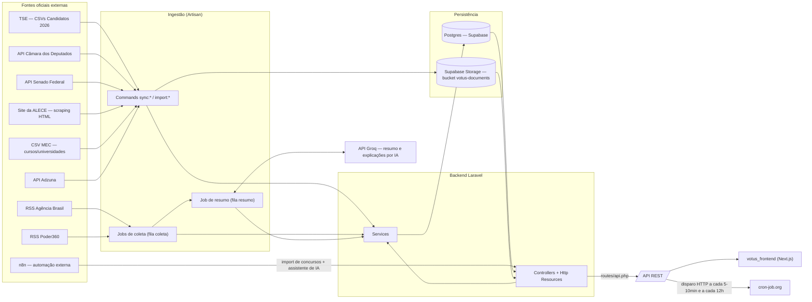

<p align="center">
    
</p>

<p align="center">
    <em>Seu voto, sua escolha, seu futuro.</em>
</p>

<p align="center">
    
</p>

# Votus — Backend (API)

## Sobre o projeto

O **Votus** é uma plataforma de transparência política desenvolvida para o **Ceará Científico 2026**. Este repositório é a **API** (Laravel), responsável por toda a coleta, normalização, persistência e disponibilização dos dados consumidos pelo [frontend](https://github.com/guisouzsa/votus_front) (Next.js).

A API cobre hoje três grandes domínios de dados políticos, cada um com fonte e escopo geográfico próprios:

- **Parlamentares em exercício** (`Legislator`) — deputados federais, senadores e deputados estaduais do **Ceará**, sincronizados das APIs oficiais da Câmara e do Senado e, para deputados estaduais, via scraping do site da ALECE (Assembleia Legislativa do Ceará), que não publica API aberta.
- **Executivos em exercício** (`Executive`) — presidente da República e governador do Ceará, com dados importados manualmente (seeder) e ações/notícias relevantes importadas por CSV.
- **Candidatos às eleições de 2026** (`Candidate`) — importados do TSE para **todos os 27 estados** (presidente é candidatura nacional; governador, senador, deputado federal e deputado estadual são por UF), incluindo histórico de candidaturas anteriores, despesas de campanha, fotos e documentos de plano de governo.

Além disso, a API mantém um pipeline próprio de **notícias** (coleta + resumo por IA), **explicações educativas com quiz** ("Você Sabia?"), **propostas cidadãs** votáveis/comentáveis, **ofertas de curso de graduação** (dados do MEC), **vagas de emprego/estágio** (Adzuna) e **concursos/processos seletivos públicos** (importados via automação externa n8n), além de um painel administrativo autenticado.

## Arquitetura



Frontend e backend são desenvolvidos e implantados separadamente. O backend não tem worker de fila contínuo em produção (ver [Jobs & Filas](#-jobs--filas)); quem drena as filas é o próprio `cron-job.org`, chamando endpoints HTTP da API.

## 📖 Fontes oficiais dos dados

| Dado | Fonte oficial | Forma de acesso |
|---|---|---|
| Candidatos 2026 (todos os cargos, 27 UFs) | [TSE — Dados Abertos, dataset "Candidatos 2026"](https://dadosabertos.tse.jus.br/dataset/candidatos-2026) | Download manual de CSVs (`consulta_cand`, info complementar, despesas, histórico de candidaturas, fotos) — **não é uma API**, é arquivo distribuído em lote por UF |
| Deputados federais e senadores do Ceará | [Câmara dos Deputados — Dados Abertos](https://dadosabertos.camara.leg.br/swagger/api.html) e [Senado Federal — Dados Abertos](https://legis.senado.leg.br/dadosabertos/api-docs/swagger-ui/index.html) | API REST pública, paginada |
| Deputados estaduais do Ceará (ALECE) | [Assembleia Legislativa do Ceará](https://www.al.ce.gov.br/deputados) | **Scraping HTML** (`Symfony\DomCrawler`) — a ALECE não publica API aberta de dados |
| Proposições dos deputados estaduais do Ceará | [www2.al.ce.gov.br/legislativo/proposicoes](https://www2.al.ce.gov.br/legislativo/proposicoes) | Scraping HTML |
| Notícias de política | [Agência Brasil](https://agenciabrasil.ebc.com.br/) (RSS oficial, 9 categorias) e [Poder360](https://www.poder360.com.br/) (RSS oficial) | Feeds RSS públicos |
| Universidades e cursos de graduação | [Portal de Dados Abertos do MEC](https://dadosabertos.mec.gov.br/) | CSV baixado manualmente e importado via comando |
| Vagas de emprego/estágio | [Adzuna](https://developer.adzuna.com/) | API REST pública (requer chave) |
| Concursos e processos seletivos públicos | Diários oficiais (agregados por automação externa) | Importado via `POST /api/public-opportunities/import`, chamado por um fluxo n8n externo ao backend — o backend só recebe e armazena, não faz a varredura dos diários |
| Resumo de notícias e geração de explicações/quiz | [Groq](https://groq.com/) (modelo configurável, padrão `openai/gpt-oss-20b`) | API REST, chamada pelo backend |
| Assistente de IA (`/api/ai-assistant/ask`) | [n8n](https://n8n.io/) (automação externa, fora deste repositório) | O backend só repassa a pergunta a um webhook n8n configurado — a lógica do assistente em si não está neste código |

## 🗂️ Domínio de dados

Para cada entidade central, o fluxo real é: **Fonte → Coleta/Importação → Normalização → Banco (Supabase) → API → Frontend**.

### Candidatos (`Candidate`)

1. **Fonte**: CSVs do TSE (`consulta_cand_2026_{UF}.csv` + arquivo de informações complementares, ambos por UF; mais CSVs separados de despesas de campanha e histórico de candidaturas).
2. **Coleta/Importação**: comandos manuais, um por tipo de dado — `sync:candidates-tse {file} {complementary_file} --uf=XX --year=2026` (dados principais), `candidates:link-running-mates --uf=XX --year=2026` (vincula vice/suplentes da mesma chapa via número de coligação do TSE), `import:candidacy-history`, `import:candidate-expenses`, `sync:candidate-expense-payments-tse`, `import:candidate-photos {dir} --disk=supabase`, `import:candidate-proposals {dir} --disk=supabase --max-size=20480`. Não há sincronização automática — cada estado/arquivo é importado manualmente, sob demanda.
3. **Normalização**: `TseCandidatesCsvService` e os demais `Tse*CsvService` leem o CSV (encoding ISO-8859-1 convertido para UTF-8), convertem datas/decimais do formato brasileiro, e o `App\Enums\CandidateOffice` mapeia a descrição de cargo do TSE (`DS_CARGO`) para um código interno (`president`, `governor`, `senator`, `federal_deputy`, `state_deputy`).
4. **Banco (Supabase/Postgres)**: tabela `candidates` (titulares e suplentes/vices na mesma tabela, ligados por `running_mate_of_id`), mais `candidacy_histories`, `candidate_expenses` e `candidate_expense_payments`. Fotos e documentos de plano de governo vão para o bucket `votus-documents` do Supabase Storage; a URL pública é montada manualmente a partir de `SUPABASE_STORAGE_PUBLIC_URL` + o path salvo (`photo_path`/`proposal_document_path`), sem passar pela fachada `Storage` do Laravel.
5. **API**: `GET /{president,governor,senate,federal-deputy,state-deputy}-candidates` (listagem paginada, filtros `state`/`party`/`search`) e o `/{external_id}` correspondente para detalhe. Resposta formatada por `CandidateResource`.
6. **Frontend**: `src/app/CandidatosPage/[office]/` — listagem com busca por região/estado (exceto Presidente, que é nacional) e perfil individual com histórico de candidaturas e, quando existe, mandato(s) anteriores como parlamentar (ligação feita por CPF).

### Deputados, Senadores e Deputados Estaduais (`Legislator`)

1. **Fonte**: API da Câmara dos Deputados, API do Senado Federal, e site da ALECE (scraping) — todos filtrados para parlamentares do **Ceará**.
2. **Coleta**: `sync:legislators-lower-house`, `sync:legislators-senate`, `sync:alece-legislators` (parlamentares); `sync:committees-lower-house`, `sync:committees-senate` (comissões); `sync:bills-lower-house`, `sync:bills-senate`, `sync:bills-alece` (proposições); `sync:bill-status` (situação atual, com controle de "obsolescência" via `--stale-days`); `sync:bill-topics` (temas); `sync:legislator-professions` (profissões declaradas). Nenhum desses comandos roda em agendamento automático hoje (ver [Limitações conhecidas](#-limitações-conhecidas)).
3. **Normalização**: `LowerHouseApiService`/`SenateApiService` encapsulam as chamadas HTTP e o parsing das respectivas APIs; `AleceLegislatorScraper`/`AleceLegislatorParser` extraem campos do HTML da ALECE via XPath/DOM; o trait `NormalizesProfessionNames` padroniza grafias de profissão vindas de fontes diferentes.
4. **Banco**: tabela única `legislators`, com a coluna `chamber` (`lower_house`/`senate`/`state_house`) distinguindo a casa legislativa — não há uma tabela por câmara. Relacionamentos N:N com `committees` (via `committee_legislator`), `bills` (via `bill_legislator`) e `professions`. Também guarda métricas pré-calculadas: `effectiveness_*`, `productivity_*`, `thematic_focus_*` (ver [Métricas](#métricas-legislativas)).
5. **API**: `GET /deputies`, `/senators`, `/state-deputies` (listagem por câmara, filtro `?state=`, formatada por `LegislatorsResource` — um subconjunto de campos, sem `raw_data`) e `GET /deputies/{external_id}`, `/senators/{external_id}`, `/state-deputies/{source_slug}` (detalhe — **retorna o Model inteiro serializado, não um Resource**: ver [Limitações conhecidas](#-limitações-conhecidas)).
6. **Frontend**: páginas `DeputadosPage`, `SenadoresPage`, `DeputadosEstaduaisPage` (listagem) e as respectivas `Show*Page/[id ou slug]` (perfil, com linha do tempo de proposições, comissões e métricas).

### Proposições (`Bill`)

1. **Fonte**: mesma origem dos parlamentares — API da Câmara, API do Senado, site da ALECE —, sempre filtradas pela autoria de um parlamentar do Ceará já sincronizado.
2. **Coleta**: `sync:bills-lower-house`, `sync:bills-senate`, `sync:bills-alece` (proposições em si); `sync:bill-status` (atualiza situação/tramitação de proposições já existentes); `sync:bill-topics` (associa temas).
3. **Normalização**: a coluna `chamber` de `bills` tem uma `CHECK constraint` no banco que restringe os valores aceitos (hoje: `lower_house`, `senate`, `state_house`); `topics.chamber` tem constraint própria que também aceita o valor `votus` (usado pelo seeder de temas internos, não ligado a uma câmara específica).
4. **Banco**: tabela `bills` (dados da proposição + bloco de status: `status_situacao`, `status_sigla`, `status_tramitando`, `status_checked_at`), `bill_tramitations` (histórico de tramitação), pivots `bill_legislator` e `bill_topic`.
5. **API**: não há um endpoint dedicado de listagem de proposições — elas são sempre expostas **aninhadas** no perfil do parlamentar (`committees`, `bills.topics` carregados em `GET /deputies/{id}` etc.) ou do candidato (`previous_mandates[].bills`, via `LegislatorSummaryResource`). `BillResource` existe no código mas não tem nenhuma rota própria que o utilize — o perfil de parlamentar serializa `bills` diretamente pelo Model.
6. **Frontend**: `ProposicoesList`/`LegislativeTimeline` no perfil de deputados/senadores/candidatos.

### Notícias (`News`)

1. **Fonte**: feeds RSS oficiais da Agência Brasil (9 categorias) e do Poder360.
2. **Coleta** (fila `coleta`): `CollectAgenciaBrasilNewsJob` e `CollectPoder360NewsJob`, um por fonte — uma falha numa fonte não afeta a outra. Cada fonte tem um "circuit breaker": é desativada automaticamente após `limite_falhas` falhas consecutivas (reativação manual via `sources:reactivate {slug}`).
3. **Normalização**: `LinkNormalizer` deduplica por link normalizado (remove `www.`, parâmetros de rastreamento, barra final); `ArticleImageExtractor` busca `og:image`/`twitter:image` na própria matéria quando o feed não traz foto; `NewsImageValidator` rejeita notícia sem imagem válida ou com imagem genérica **antes** de persistir — nunca entra no banco notícia sem imagem aprovada.
4. **Resumo** (fila `resumo`): `SummarizeNewsJob` chama `GroqSummarizerService` (rotação entre até 5 chaves Groq, fallback sequencial em caso de falha de uma delas) para gerar resumo, nota de relevância (0–10) e decidir se é publicável.
5. **Banco**: tabela `news` (campos públicos + campos internos do pipeline: `status_resumo`, `erro_resumo`, `fonte_id`, `link_normalizado`) e `fontes` (cadastro de fonte + contadores do circuit breaker). O Model da fonte se chama `NewsSource` (a tabela continua `fontes`).
6. **API**: `GET /news` (paginado, filtros `search`, `relevance_min`, `sort_by`, `direction`, `per_page` até 150, mais o campo extra `destaque` só na página 1) e `GET /news/{id}` — ambos via `NewsResource`, que **nunca** expõe os campos internos do pipeline. `POST /news` existe para cadastro manual, protegido por token interno.

Ver também [🔄 Pipeline de notícias](#-pipeline-de-notícias) para o mecanismo de disparo em produção (sem worker de fila contínuo).

## 🧩 Outros módulos

| Módulo | Models/Controllers principais | Resumo |
|---|---|---|
| Executivos em exercício | `Executive`, `ExecutiveAction`, `ExecutiveController`, `ExecutiveService` | Presidente e governador do Ceará — dados cadastrados manualmente (`ExecutiveSeeder`), ações/notícias relevantes importadas por CSV (`import:executive-actions`) |
| Explicações / "Você Sabia?" | `Explanation`, `ExplanationSource`, `QuizQuestion`, `QuizOption`, `TrustedSource` | Conteúdo educativo + quiz de 5 perguntas, gerado por IA (`GroqExplanationService`) a partir de uma URL de fonte confiável cadastrada pelo admin; publicação é manual |
| Propostas cidadãs | `Proposal`, `ProposalVote`, `ProposalComment`, `Category` | Propostas públicas (criadas por qualquer visitante), votação ("legal"/"não apoio") e comentários identificados por um UUID anônimo (header `X-Visitor-Id`), sem cadastro de usuário |
| Universidades e cursos | `University`, `Campus`, `CourseOffering`, `CourseCurriculum`, `CurriculumSubject`, `AdmissionMethod` | Catálogo de cursos de graduação do MEC, com busca por estado/município/curso/setor/modalidade |
| Vagas de emprego | `Opportunity` | Importadas da Adzuna (`jobs:import-adzuna`); busca por tipo/local/texto |
| Concursos públicos | `PublicOpportunity`, `OpportunityPublication` | Importados via automação n8n externa (`POST /public-opportunities/import`), com fila de moderação (aprovar/rejeitar/publicar) no painel admin |
| Sugestões | `Suggestion`, `SuggestionAnswer`, `SuggestionQuestion` | Pesquisa pública com perguntas dinâmicas geridas pelo admin |
| Santinho eleitoral | `SantinhoGeneration` | O PDF é gerado 100% no frontend (jsPDF); o backend só registra que uma geração aconteceu, para fins de contagem |
| Visitas ao site | `SiteVisit` | Registro anônimo de acesso, sem dado de identificação |
| Métricas legislativas | `LegislativeEffectivenessService`, `LegislativeProductivityService`, `ThematicFocusService`, `ThematicConsistencyService` | Calculadas sob demanda via comandos (`metrics:effectiveness`, `metrics:productivity`, `metrics:thematic-focus`) e persistidas em colunas de `legislators` |
| Painel administrativo | `App\Http\Controllers\Admin\*` | Autenticado via Sanctum (token Bearer, sem sessão/cookie); gerencia notícias, explicações, propostas, sugestões, fontes confiáveis e concursos públicos |

## 📡 Referência de API

Base: `/api`. Todas as rotas dentro do grupo `cache.headers` recebem `Cache-Control` em respostas `GET 200` (dados públicos que não mudam a cada segundo).

### Parlamentares em exercício

| Método | Rota | Parâmetros | Descrição |
|---|---|---|---|
| GET | `/deputies` | `?state=` | Lista deputados federais (padrão: Ceará) |
| GET | `/deputies/{external_id}` | — | Perfil completo (Model serializado, sem Resource) |
| GET | `/senators` | `?state=` | Lista senadores |
| GET | `/senators/{external_id}` | — | Perfil completo |
| GET | `/state-deputies` | `?state=` | Lista deputados estaduais (ALECE) |
| GET | `/state-deputies/{source_slug}` | — | Perfil completo (chave é um slug, não um id numérico) |

Exemplo de item de `GET /deputies` (via `LegislatorsResource`):
```json
{
  "external_id": 220593,
  "chamber": "lower_house",
  "parliamentary_name": "Fulano da Silva",
  "photo_url": "https://www.camara.leg.br/...",
  "party": "PT",
  "state": "CE",
  "electoral_status": "sitting",
  "status": "active",
  "source_slug": null,
  "metrics": {
    "effectiveness": { "rate": 0.42, "wilson_lower": 0.31, "total_bills": 50, "advanced_bills": 21, "calculated_at": "2026-09-20T12:00:00Z" },
    "productivity": { "bills_per_year": 12.5 },
    "thematic_focus": { "index": 0.6, "total_bills": 50, "top_topic": { "id": 3, "name": "Saúde", "share": 0.4 } }
  }
}
```

### Executivos em exercício

| Método | Rota | Parâmetros | Descrição |
|---|---|---|---|
| GET | `/president` | — | Presidente/vice em exercício |
| GET | `/president/{id}` | — | Detalhe, com `actions` (ações/notícias relevantes) |
| GET | `/governors` | `?state=` | Governador/vice em exercício |
| GET | `/governors/{id}` | — | Detalhe, com `actions` |

### Candidatos (eleições 2026)

| Método | Rota | Parâmetros | Descrição |
|---|---|---|---|
| GET | `/president-candidates` | `?state=&party=&search=&page=` | Candidatos a presidente (nacional) |
| GET | `/president-candidates/{external_id}` | — | Perfil |
| GET | `/governor-candidates` | `?state=&party=&search=&page=` | Candidatos a governador |
| GET | `/governor-candidates/{external_id}` | — | Perfil |
| GET | `/senate-candidates` | idem | Candidatos a senador |
| GET | `/senate-candidates/{external_id}` | — | Perfil |
| GET | `/federal-deputy-candidates` | idem | Candidatos a deputado federal |
| GET | `/federal-deputy-candidates/{external_id}` | — | Perfil |
| GET | `/state-deputy-candidates` | idem | Candidatos a deputado estadual |
| GET | `/state-deputy-candidates/{external_id}` | — | Perfil |

Toda listagem de candidatos devolve, além de `data`/`links`/`meta` (paginação padrão Laravel), um bloco `filters`:
```json
{
  "data": [ { "id": 123456, "ballot_number": "13", "round": 1, "state": "CE", "office": "DEPUTADO ESTADUAL", "civil_name": "...", "ballot_name": "...", "party": { "acronym": "PT", "name": "Partido dos Trabalhadores" }, "education_level": "SUPERIOR COMPLETO", "occupation": "...", "race_color": "...", "photo_url": "https://.../votus-documents/...", "proposal_document_url": null, "election_year": 2026, "judgment_status": "DEFERIDO" } ],
  "filters": {
    "parties": ["PT", "PSDB", "..."],
    "with_proposal_document": 12,
    "with_higher_education": 340,
    "with_full_ticket": 5,
    "previously_elected": 28
  }
}
```
Perfil individual (`GET /{office}-candidates/{id}`) inclui também `running_mates` (chapa), `previous_mandates` (mandatos como parlamentar, cruzados por CPF — cada um já traz `bills` quando houver) e `candidacy_history` (candidaturas anteriores pelo TSE).

### Notícias

| Método | Rota | Parâmetros | Descrição |
|---|---|---|---|
| GET | `/news` | `?search=&relevance_min=&sort_by=&direction=&per_page=` | Listagem paginada; página 1 inclui `destaque` |
| GET | `/news/{news}` | — | Detalhe (404 se não publicada) |
| POST | `/news` | header `X-Scheduler-Token` | Cadastro manual (mesmo token do Scheduler) |

`sort_by` aceita apenas `published_at`, `imported_at`, `relevance_score`, `created_at` (qualquer outro valor cai para `published_at`). `per_page` tem teto de 150.

### Propostas cidadãs

| Método | Rota | Parâmetros | Descrição |
|---|---|---|---|
| GET | `/proposals` | header opcional `X-Visitor-Id` | Lista propostas, com `viewer_vote` se o header for enviado |
| GET | `/proposals/{id}` | idem | Detalhe |
| POST | `/proposals` | `title, content, author, categories?` — throttle 10/min | Cria proposta (sempre publicada) |
| POST | `/proposals/{id}/vote` | header `X-Visitor-Id` obrigatório, body `vote: legal\|not_support` — throttle 20/min | Vota/atualiza voto |
| DELETE | `/proposals/{id}/vote` | header `X-Visitor-Id` obrigatório — throttle 20/min | Remove o voto do visitante |
| GET | `/proposals/{id}/comments` | — | Lista comentários |
| POST | `/proposals/{id}/comments` | throttle 15/min | Cria comentário |
| DELETE | `/proposals/{id}/comments/{commentId}` | throttle 15/min | Remove comentário |

### Categorias, explicações, universidades, oportunidades

| Método | Rota | Parâmetros | Descrição |
|---|---|---|---|
| GET | `/categories` | `?q=` | Autocomplete de categorias de proposta |
| GET | `/explanations` | — | Lista explicações publicadas (12/página) |
| GET | `/explanations/{explanation}` | — | Detalhe com fontes e quiz (404 se não publicada) |
| GET | `/universities/{university}` | — | Detalhe com campi, cursos e modalidades de ingresso |
| GET | `/course-offerings` | `?state=&city_code=&course=&sector=public\|private&modality=` | Busca de ofertas de curso, com `filter_options` (estados/modalidades/municípios/cursos disponíveis) |
| GET | `/course-offerings/{courseOffering}` | — | Detalhe com matriz curricular |
| GET | `/course-offerings/options/municipalities` | `?state=` (obrigatório) | Municípios do estado |
| GET | `/course-offerings/options/courses` | `?state=&city_code=` (obrigatórios) | Cursos do município |
| GET | `/public-opportunities` | `?search=&type=&state=&municipality=` | Concursos aprovados, ordenados por fim de inscrição |
| GET | `/public-opportunities/{publicOpportunity}` | — | Detalhe com publicações no diário oficial |
| GET | `/opportunities` | `?type=&location=&search=` | Vagas ativas (12/página) |

### Interação, telemetria e IA

| Método | Rota | Parâmetros | Descrição |
|---|---|---|---|
| POST | `/ai-assistant/ask` | throttle 10/min | Repassa a pergunta a um webhook n8n externo |
| POST | `/santinhos` | throttle 30/min | Registra 1 geração de santinho |
| POST | `/site-visits` | throttle 30/min | Registra 1 acesso anônimo |
| POST | `/suggestions` | throttle 10/min | Envia pesquisa de sugestões (respostas dinâmicas) |
| GET | `/suggestion-questions` | — | Lista perguntas ativas da pesquisa |

### Internas e Scheduler

| Método | Rota | Auth | Descrição |
|---|---|---|---|
| GET | `/schedule/status` | nenhuma | Healthcheck |
| POST | `/schedule/coletar-noticias` | header `X-Scheduler-Token` ou `?token=`, throttle 6/min | Dispara coleta + drena fila (chamado pelo cron-job.org a cada 12h) |
| POST | `/schedule/processar-fila-noticias` | idem | Só drena a fila pendente (chamado a cada 5–10min) |
| GET | `/internal/committee-topic-matches/pending` | `auth:sanctum` | Fila de revisão humana de temas sugeridos por IA para comissões |
| POST | `/internal/committee-topic-matches/{committeeTopic}/review` | `auth:sanctum` | Aprova/rejeita a sugestão |
| POST | `/public-opportunities/import` | token interno | Upsert de concursos, chamado pelo fluxo n8n externo |

### Painel administrativo (`/admin/*`, `auth:sanctum` + middleware `admin`)

| Método | Rota | Descrição |
|---|---|---|
| POST | `/admin/login` | Autentica (throttle 10/min) |
| POST | `/admin/logout` | Revoga o token atual |
| GET | `/admin/me` | Dados do admin autenticado |
| GET | `/admin/dashboard` | Agregados (notícias, dados políticos, participação, moderação, sugestões) |
| GET/POST/DELETE | `/admin/news`, `/news/collect`, `/news/drain`, `/news/{id}` | Gestão de notícias e disparo manual do pipeline |
| GET/DELETE/PATCH | `/admin/proposals`, `/proposals/{id}`, `/{id}/permanent`, `/{id}/restore`, `/{id}/comments`, `/{id}/comments/{commentId}` | Moderação de propostas e comentários |
| GET/POST/DELETE | `/admin/suggestions`, `/suggestions/{id}` | Moderação/criação manual de sugestões |
| GET/POST/PUT/DELETE | `/admin/suggestion-questions` | Gestão das perguntas da pesquisa |
| GET/POST/PUT/PATCH/DELETE | `/admin/explanations`, `/explanations/drain`, `/{id}`, `/{id}/publish`, `/{id}/unpublish` | CRUD de explicações + geração assíncrona |
| GET/POST/PUT/DELETE | `/admin/trusted-sources` | Gestão de fontes confiáveis para geração de explicações |
| GET/PUT/POST/PATCH | `/admin/public-opportunities`, `/{id}`, `/{id}/approve`, `/{id}/reject`, `/{id}/toggle-published` | Moderação de concursos importados |

## 🔄 Jobs & Filas

A aplicação usa o sistema de filas nativo do Laravel (`QUEUE_CONNECTION=database`), com duas filas nomeadas:

| Fila | Job(s) | Propósito |
|---|---|---|
| `coleta` | `CollectAgenciaBrasilNewsJob`, `CollectPoder360NewsJob` | Buscar e persistir notícias novas de cada fonte |
| `resumo` | `SummarizeNewsJob` | Gerar resumo/relevância por IA para cada notícia coletada |
| `explanations` | `GerarConteudoExplicacaoJob` | Gerar o conteúdo + quiz de uma explicação via IA |

**Não há worker de fila contínuo em produção** — o plano gratuito da hospedagem (Render) não mantém um processo em segundo plano. Em vez disso, dois agendamentos no **cron-job.org** (externo) chamam endpoints HTTP que executam `php artisan queue:work --stop-when-empty` dentro da própria requisição:

| Frequência | Endpoint | Função |
|---|---|---|
| A cada 12h (06:00 e 18:00) | `POST /api/schedule/coletar-noticias` | Despacha a coleta e já começa a drenar a fila |
| A cada 5–10 min | `POST /api/schedule/processar-fila-noticias` | Só drena o que ainda está pendente |

Os dois agendamentos existem porque o resumo respeita rate limiting (10 chamadas de IA/min) — se só a coleta de 12 em 12h drenasse a fila, o volume coletado de uma vez nunca terminaria de ser resumido antes da próxima leva.

`routes/console.php` **não tem nenhum `Schedule::command()` ativo** hoje — os seis agendamentos de sincronização legislativa (Câmara/Senado) que existiam ali estão comentados; a sincronização de parlamentares/proposições/candidatos é, atualmente, sempre manual.

## 🗄️ Banco de dados e Supabase

PostgreSQL hospedado no **Supabase**. Principais tabelas (nome real da tabela, nem sempre igual ao nome da classe do Model):

| Tabela | Model | Conteúdo |
|---|---|---|
| `legislators` | `Legislator` | Parlamentares em exercício (`chamber`: lower_house/senate/state_house) |
| `candidates` | `Candidate` | Candidatos 2026 (titulares e chapa) |
| `candidacy_histories`, `candidate_expenses`, `candidate_expense_payments` | — | Histórico de candidaturas e despesas de campanha do TSE |
| `executives`, `executive_actions` | `Executive`, `ExecutiveAction` | Presidente/governador em exercício e suas ações |
| `bills`, `bill_tramitations`, `bill_legislator`, `bill_topic` | `Bill`, `BillTramitation` | Proposições legislativas |
| `committees`, `committee_legislator`, `committee_topic` | `Committee`, `CommitteeTopic` | Comissões parlamentares |
| `topics` | `Topic` | Temas/eixos de proposições |
| `fontes` | `NewsSource` | Fontes de coleta de notícias (nome da classe difere do nome da tabela) |
| `news` | `News` | Notícias coletadas/resumidas |
| `explanations`, `explanation_sources`, `quiz_questions`, `quiz_options`, `trusted_sources` | — | Conteúdo educativo + quiz |
| `proposals`, `proposal_votes`, `proposal_comments`, `categories` | — | Propostas cidadãs |
| `universities`, `campuses`, `course_offerings`, `course_curricula`, `curriculum_subjects`, `admission_methods` | — | Catálogo MEC |
| `opportunities` | `Opportunity` | Vagas (Adzuna) |
| `public_opportunities`, `opportunity_publications` | — | Concursos públicos |
| `suggestions`, `suggestion_answers`, `suggestion_questions` | — | Pesquisa de sugestões |
| `santinho_generations`, `site_visits` | — | Contadores de telemetria anônima |
| `legislature_periods` | `LegislaturePeriod` | Datas de início/fim de legislatura por câmara |
| `users` | `User` | Apenas administradores do painel (coluna `is_admin`) |

### Supabase Storage

Bucket `votus-documents`, acessado via disco `supabase` (driver S3-compatível, `use_path_style_endpoint=true`). Usado para dois tipos de arquivo, ambos ligados a `Candidate`:

- Fotos de candidatos (`photo_path`), importadas por `import:candidate-photos`.
- Documentos de plano de governo em PDF (`proposal_document_path`), importados por `import:candidate-proposals`.

A URL pública não passa pela fachada `Storage::url()` — é montada manualmente nos acessores do Model `Candidate` a partir de `SUPABASE_STORAGE_PUBLIC_URL`. Não há uso de Supabase Storage para santinhos (gerados 100% no frontend) nem para uploads do painel admin. Nenhuma política de RLS foi verificada neste levantamento — o acesso ao bucket e ao banco hoje é feito inteiramente com credenciais de serviço, pelo backend.

## 🔧 Variáveis de ambiente

Apenas os **nomes** usados pelo projeto (ver `.env.example` para a lista completa e comentada; nenhum valor real é citado aqui):

| Variável | Finalidade |
|---|---|
| `APP_KEY`, `APP_ENV`, `APP_DEBUG`, `APP_URL` | Configuração padrão do Laravel |
| `DB_CONNECTION`, `DB_HOST`, `DB_PORT`, `DB_DATABASE`, `DB_USERNAME`, `DB_PASSWORD` | Conexão com o Postgres (Supabase) |
| `QUEUE_CONNECTION`, `SESSION_DRIVER`, `CACHE_STORE` | Drivers de fila/sessão/cache (local: `database`) |
| `SCHEDULER_TOKEN` | Token aceito em `X-Scheduler-Token` — usado pelo Scheduler e pelas rotas com middleware `internal.token` |
| `N8N_WEBHOOK_URL` | Webhook do assistente de IA (`/api/ai-assistant/ask`) |
| `GROQ_BASE_URL`, `GROQ_MODEL`, `GROQ_API_KEY_1` a `GROQ_API_KEY_5` | Credenciais e config da IA (resumo de notícias e geração de explicações); não é preciso preencher as 5 chaves |
| `SUPABASE_STORAGE_KEY`, `SUPABASE_STORAGE_SECRET`, `SUPABASE_STORAGE_REGION`, `SUPABASE_STORAGE_BUCKET`, `SUPABASE_STORAGE_ENDPOINT`, `SUPABASE_STORAGE_PUBLIC_URL` | Credenciais do Supabase Storage (disco `supabase`) |
| `ADZUNA_APP_ID`, `ADZUNA_APP_KEY`, `ADZUNA_COUNTRY` | Credenciais da API de vagas |
| `AWS_ACCESS_KEY_ID`, `AWS_SECRET_ACCESS_KEY`, `AWS_DEFAULT_REGION`, `AWS_BUCKET` | Disco `s3` padrão do Laravel (não usado pelo domínio da aplicação hoje — só existe por ser o template padrão) |

## 🚀 Desenvolvimento local

Pré-requisitos confirmados em `composer.json`: **PHP ^8.3**, Composer 2.

```bash
git clone https://github.com/NotCrazyDog-hub/votus-general-api.git
cd votus-general-api
composer install
copy .env.example .env
php artisan key:generate
php artisan storage:link
php artisan migrate
php artisan db:seed --class=NewsSourcesSeeder
php artisan db:seed --class=SuggestionQuestionsSeeder
php artisan db:seed --class=LegislaturePeriodSeeder
```

O `composer.json` também define um script único que sobe API + fila + logs + build do frontend simultaneamente (via `concurrently`):

```bash
composer dev
```

Para sincronizar dados reais (sem isso o banco fica vazio de parlamentares/proposições):

```bash
php artisan sync:legislators-lower-house && php artisan sync:committees-lower-house && \
php artisan sync:legislators-senate && php artisan sync:committees-senate && \
php artisan sync:bills-lower-house && php artisan sync:bills-senate && \
php artisan sync:bill-status && php artisan sync:bill-topics && \
php artisan sync:legislator-professions
```

Candidatos do TSE (exemplo para um estado):

```bash
php artisan sync:candidates-tse storage/app/tse/consulta_cand_2026_CE.csv storage/app/tse/consulta_cand_2026_CE_info.csv --uf=CE --year=2026
php artisan candidates:link-running-mates --uf=CE --year=2026
```

Testes:

```bash
composer test
```

## 🌐 Deploy

- **Hospedagem da API**: [Render](https://render.com/) (plano free — sem worker de fila contínuo, por isso o pipeline de notícias depende de disparo HTTP externo).
- **Banco de dados**: [Supabase](https://supabase.com/) (Postgres gerenciado + Storage S3-compatível).
- **Containerização**: Docker (build usado pelo Render).
- **Agendamento externo**: [cron-job.org](https://cron-job.org/) dispara `/api/schedule/*` nos horários descritos em [Jobs & Filas](#-jobs--filas).
- **Geração de resumos/explicações por IA**: [Groq](https://groq.com/).
- **Automação externa (import de concursos e assistente de IA)**: [n8n](https://n8n.io/), fora deste repositório.

## 🔐 Segurança

- Rotas administrativas usam Laravel Sanctum (token Bearer) + middleware `admin`, que verifica `is_admin` no usuário autenticado — não há sessão/cookie.
- Rotas "internas" (`POST /news`, `POST /public-opportunities/import`) e o Scheduler são protegidos pelo mesmo `SCHEDULER_TOKEN`, validado com `hash_equals` (comparação em tempo constante) via o middleware `internal.token` (`VerificaTokenInterno`).
- Endpoints de escrita pública (`/proposals`, `/proposals/{id}/vote`, `/suggestions`, `/santinhos`, `/site-visits`, `/ai-assistant/ask`) têm `throttle` por IP.
- Votos e comentários de propostas identificam o autor por um UUID anônimo gerado no navegador (header `X-Visitor-Id`), sem cadastro — não há como vincular a uma pessoa real.
- `NewsResource` e `ExplanationController::show`/`NewsController::show` filtram explicitamente conteúdo não publicado e campos internos do pipeline antes de qualquer resposta pública.
- Existe um middleware `EnsureN8nToken` no código que **não está registrado** em nenhuma rota — hoje não tem efeito algum (ver [Limitações conhecidas](#-limitações-conhecidas)).

## 📐 Convenções

- Nomenclatura de código (classes, métodos, variáveis) majoritariamente em inglês; strings de erro/validação e comentários explicativos em português.
- O domínio distingue **sempre** `Candidate` (candidatura a um cargo, dados do TSE) de `Legislator` (parlamentar em exercício, dados de Câmara/Senado/ALECE) — são tabelas e fluxos de importação totalmente separados, ligados apenas por CPF quando aplicável.
- Toda listagem pública usa `paginate()` (não `simplePaginate()`), propositalmente, para o frontend saber o total real de páginas.
- Comandos de importação (`import:*`) recebem um arquivo/diretório local; comandos de sincronização (`sync:*`) chamam uma API externa ou fazem scraping — a distinção de prefixo é intencional.

## ⚠️ Limitações conhecidas

- **Sem sincronização automática**: todos os comandos `sync:*`/`import:*` de parlamentares, proposições e candidatos são disparados manualmente; os seis `Schedule::command()` que existiam para isso estão comentados em `routes/console.php`.
- **Sem worker de fila contínuo em produção**: o pipeline de notícias depende de disparo HTTP externo (cron-job.org) dentro do tempo de uma requisição (`--max-time=20`), não de um processo `queue:work` permanente.
- **Inconsistência de formato entre listagem e detalhe de parlamentar**: `GET /deputies`/`/senators`/`/state-deputies` usa `LegislatorsResource` (campos selecionados), mas `GET /deputies/{id}` etc. retorna o **Model inteiro serializado**, incluindo `raw_data` e todas as colunas internas — não há padronização de shape entre os dois.
- **`BillResource` não é usado por nenhuma rota**: proposições são sempre serializadas por relacionamento direto do Model (no perfil de parlamentar/candidato), não por esse Resource.
- **`EnsureN8nToken` é código órfão**: existe a classe, mas não está registrada como alias de middleware em nenhuma rota; a leitura de config que ela faz (`services.n8n.import_token`) também não existe em `config/services.php`.
- **Campos "fantasma" em `$fillable`**: `Candidate::$fillable` inclui `source`/`source_slug`/`source_url`, que não existem como colunas na tabela `candidates`; `Bill::$fillable` inclui `legislator_id`, removido por migration posterior. Não causam erro (Eloquent ignora o que não existe na tabela ao salvar), mas não refletem o schema real.
- **Sem testes para os módulos mais recentes**: a suíte de testes cobre bem o pipeline de notícias e o de explicações; não há testes para candidatos, parlamentares, proposições, propostas cidadãs, universidades ou oportunidades.
- **Dados de candidatos restritos ao TSE**: sem painel de acompanhamento de patrimônio/prestação de contas em tempo real — é uma foto do que o TSE publicou no momento da importação.

## 🏗️ Decisões arquiteturais

- A implementação atual utiliza **duas tabelas de pessoas físicas separadas** (`candidates` e `legislators`) em vez de uma tabela unificada de "pessoa política", porque as fontes, o ciclo de vida e os campos de cada uma são genuinamente diferentes (candidatura por eleição vs. mandato em exercício); a ligação entre as duas é feita em tempo de consulta, por CPF.
- A implementação atual utiliza **polling HTTP externo (cron-job.org) em vez de um worker de fila sempre ativo**, porque o plano de hospedagem atual (Render free) não oferece processo de background contínuo.
- A implementação atual utiliza **duas filas nomeadas (`coleta`/`resumo`) com frequências de drenagem diferentes**, porque o resumo por IA tem rate limit (10/min) e coletar e resumir no mesmo ciclo de 12h faria o backlog de resumo nunca esvaziar antes da próxima coleta.
- A implementação atual utiliza **validação de imagem antes da persistência da notícia** (não depois), porque o requisito do produto é nunca exibir notícia sem imagem visualmente aceitável — rejeitar antes de salvar evita ter que filtrar de novo em toda leitura.
- A implementação atual utiliza **cache em arquivo (não no banco) para os agregados de candidatos** (`partiesByOffice`, contadores), porque esses números só mudam quando um `sync:candidates-tse` roda manualmente, e cachear no próprio Postgres custaria a mesma viagem ao Supabase que o cache existe para evitar.
- A implementação atual utiliza **scraping HTML para a ALECE**, porque a Assembleia Legislativa do Ceará não publica uma API de dados abertos equivalente à da Câmara ou do Senado.

## ✅ Checklist do backend

- [x] Models documentados e conferidos contra `app/Models/`
- [x] Controllers cruzados contra `routes/api.php` (nenhuma rota órfã encontrada)
- [x] Services, Jobs e Commands listados a partir do código real
- [x] Migrations revisadas em ordem cronológica
- [x] Variáveis de ambiente documentadas por nome, sem nenhum valor/segredo
- [x] Nenhum endpoint, tabela ou Job inventado
- [x] Limitações conhecidas descritas como tal, não omitidas

---

<p align="center">
    Desenvolvido pela equipe do Votus.
</p>
